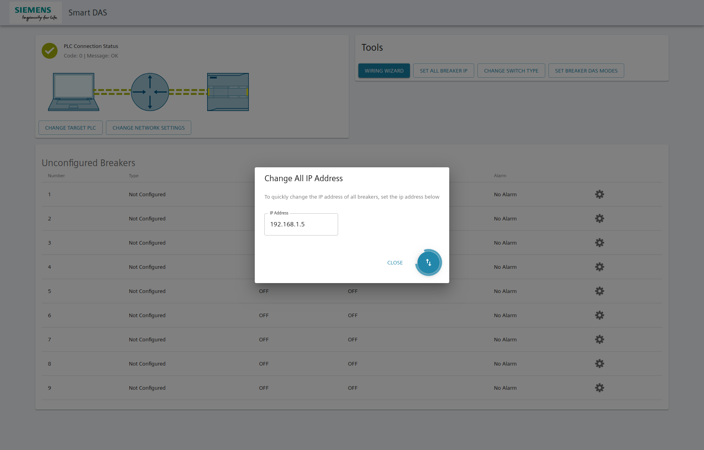

# Smart DAS App
- [Smart DAS App](#Smart-DAS-App)
  - [About the project](#About-the-project)
  - [Build scripts](#Build-scripts)
    - [Extra steps for Windows Builds](#Extra-steps-for-Windows-Builds)
    - [Known bugs](#Known-bugs)
  - [Backend DotNet Core Application](#Backend-DotNet-Core-Application)
  - [Frontend React.js Application](#Frontend-Reactjs-Application)
    - [Snapshots](#Snapshots)

## About the project
The project is a combination of a backend api written in [dotnet core](https://docs.microsoft.com/en-us/dotnet/core/) and a frontend written in javascript using the [React.js](https://reactjs.org/) library. Both projects are wrapped up in an [electron](https://electronjs.org/) application.

The backend api exposes a number of http endpoints for the frontend app to digest.

## Build scripts

To build the application run the shell scripts found in the root folder. These scripts are labeled as follows:
- `build-linux.sh`
- `build-mac.sh`
- `build-windows.sh`

You will need the following software packages installed in order to build the application:
- [yarn](https://yarnpkg.com/en/)
- [node.js](https://nodejs.org/en/)
- [dotnet core ^2.2.0](https://dotnet.microsoft.com/download)

Note: Although both linux and mac os x builds can be created on any OS X environment, it is recommended to compile the linux build on the target host environment you plan to run it in.

Note: To create the dmg file for mac, you must run the build scripts on a mac computer.

### Extra steps for Windows Builds
If building for windows, you will need a command line utility that can run bash shell scripts. The following are some example utilities:
- if you have gitbash installed, it comes with a built in utility. Just open gitbash, navigate to this directory, and run `sh build-windows.sh`

### Known bugs
- Windows throws write protection error code after building for the second time
  - Error: `The process cannot access the file because it is being used by another process.`
  - Solution 1: If you have a code editor open that is accessing the files, close the program and run the script again.
  - Solution 2: If 1 does not work, then log out and log back in and run the script again.

## Backend DotNet Core Application
The documentation for the dotnet http rest application can be found below: 
[documentation](./server/README.md)

The backend uses the [SmartDAS dotnet api](https://code.siemens.com/smart-gear-gp/smartdas) to communicate via SNAP7 to the external PLC. It relays these messages over http to the frontend application.

## Frontend React.js Application
The documentation for the frontend react application can be found below: 
[documentation](./client/README.md)

### Snapshots
Main dashboard:

Wiring Wizard:

Change All Breaker IP Address Dialog:

Connection Gateway Error:

Set Breaker DAS Modes:
